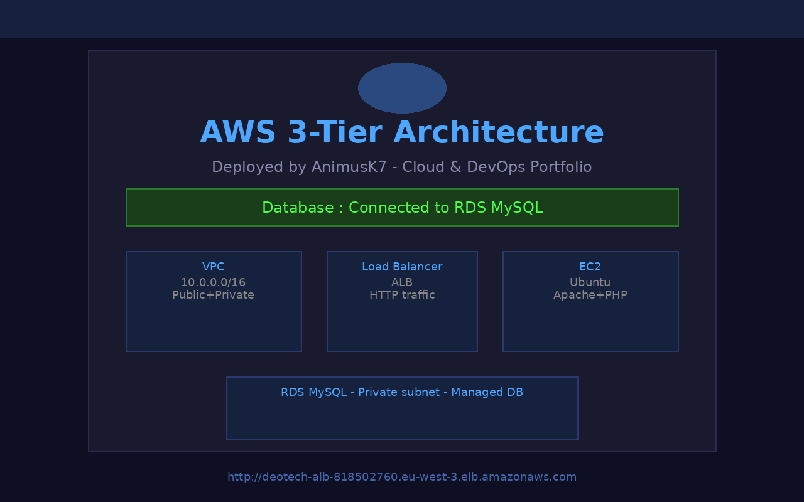
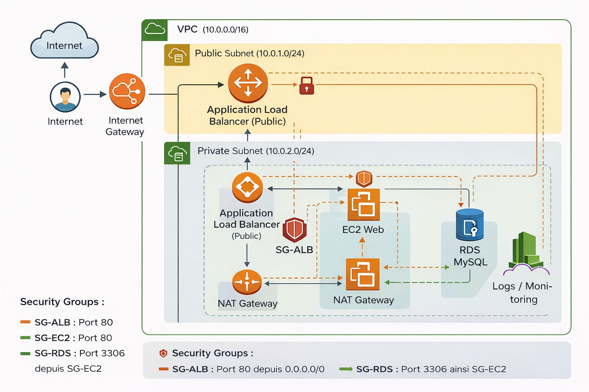

# AWS 3-Tier Architecture Project 🚀
<!-- Phase 2 CI/CD - GitHub Actions Pipeline activé -->
<!-- Pipeline test #3 - cle SSH corrigee -->

## 📌 Description

Ce projet démontre le déploiement manuel d'une architecture cloud sécurisée et scalable sur AWS, organisée en 3 tiers distincts : accès, application et base de données.

Tout est configuré manuellement via la console AWS, sans outil d'infrastructure as code.

---

## 🌐 Application en ligne — Lien public

> **✅ L'application est déployée et accessible publiquement :**
>
> ### 👉 [http://deotech-alb-818502760.eu-west-3.elb.amazonaws.com](http://deotech-alb-818502760.eu-west-3.elb.amazonaws.com)

---

## 📸 Preuve de fonctionnement



> La capture ci-dessus montre l'application **AWS 3-Tier Architecture** accessible via l'ALB public, avec le message **"Database : Connected to RDS MySQL"** confirmant la connexion réussie entre l'EC2 et la base de données RDS en subnet privé.

---

## 🧱 Architecture



L'architecture repose sur un VPC isolé avec des subnets publics et privés, un Load Balancer exposé sur Internet, des instances EC2 en backend, et une base de données RDS MySQL entièrement isolée du trafic public.

## 🗂️ Structure du projet

```
aws-3tier-portfolio/
|
|-- app/
|   |-- index.php
|
|-- scripts/
|   |-- install.sh
|
|-- screenshots/
|   |-- app-deployed.png
|
|-- Architecture.jpeg
|-- README.md
```

## ☁️ Composants AWS

| Composant | Role |
|---|---|
| VPC | Reseau isole pour tout l'environnement |
| Internet Gateway | Acces Internet entrant vers le subnet public |
| NAT Gateway | Acces Internet sortant depuis le subnet prive |
| Application Load Balancer | Distribution du trafic HTTP vers les EC2 |
| EC2 (Web Server) | Hebergement de l'application PHP |
| RDS MySQL | Base de donnees en subnet prive |
| Security Groups | Controle des flux reseau entre chaque composant |

## ⚙️ Etapes de deploiement

### 1. VPC et sous-reseaux

- Creer un VPC avec CIDR `10.0.0.0/16`
- Subnets :
  - **Public** : `10.0.1.0/24` pour l'ALB
  - **Prive** : `10.0.2.0/24` pour RDS

### 2. Connectivite reseau

- Attacher une **Internet Gateway** au VPC
- Creer une **NAT Gateway** dans le subnet public
- Configurer les **tables de routage**

### 3. Security Groups

- **SG-ALB** : port 80 depuis Internet
- **SG-EC2** : port 80 depuis SG-ALB uniquement
- **SG-RDS** : port 3306 depuis SG-EC2 uniquement

### 4. EC2

- Instance Ubuntu dans le subnet public
- Installation Apache + PHP :

```bash
bash scripts/install.sh
```

- Deploiement de l'application :

```bash
sudo cp app/index.php /var/www/html/index.php
```

### 5. RDS MySQL

- Instance RDS MySQL dans le subnet prive
- Acces public desactive
- Associer SG-RDS
- Base de donnees `appdb` creee manuellement

### 6. Application Load Balancer

- ALB dans les subnets publics
- Target Group pointant vers EC2
- Listener sur le port 80

## 🎯 Resultat

L'application est accessible via :

```
http://deotech-alb-818502760.eu-west-3.elb.amazonaws.com
```

**Statut base de donnees** : ✅ Connected to RDS MySQL

La base de donnees RDS reste isolee dans le subnet prive, accessible uniquement depuis EC2.

## 💼 Competences demontrees

- Conception et segmentation d'un VPC AWS
- Gestion des Security Groups et du routage reseau
- Deploiement d'une application PHP sur EC2
- Configuration d'une base de donnees RDS MySQL managee
- Mise en place d'un Application Load Balancer
- Securisation d'une architecture multi-tiers sur AWS
- Connexion inter-services securisee (EC2 → RDS)

## 👤 Auteur

**Decardo Koumous Wouile (AnimusK7)**
Cloud & DevOps Enthusiast | Tunis, Tunisia
[GitHub](https://github.com/AnimusKWD)

## 🔄 Evolution du projet — Pourquoi pas de CI/CD pour l'instant ?

> Ce projet a été volontairement réalisé en **déploiement 100% manuel** via la console AWS.
>
> **Pourquoi ce choix ?** L'objectif principal de ce portfolio est de démontrer une **maîtrise complète et approfondie des services AWS** : comprendre chaque composant (VPC, EC2, RDS, ALB, Security Groups) en le configurant à la main, sans abstractions automatisées. C'est ce qui prouve la compétence réelle sur le cloud.

### Phase 1 — Déploiement manuel ✅ (état actuel)

- Configuration manuelle de l'ensemble de l'infrastructure AWS
- Objectif : comprendre et maîtriser chaque couche de l'architecture
- Aucun outil d'automatisation (pas de Terraform, pas de CI/CD)

### Phase 2 — Automatisation avec CI/CD 🚧 (à venir)

- Ajout d'un pipeline **GitHub Actions** dans `.github/workflows/`
- Déploiement automatique du code sur EC2 à chaque `git push` sur `main`
- Intégration de tests et de validations avant déploiement
- Objectif : montrer la progression vers une approche **DevOps complète**

### Phase 3 — Infrastructure as Code 📋 (prévu)

- Migration de la configuration manuelle vers **Terraform**
- Tout l'environnement AWS décrit en code, versionné et reproductible
- Objectif : démontrer des compétences **Cloud + DevOps** de bout en bout

> 💡 **Note pour les recruteurs et visiteurs :** Le dossier `.github/workflows` n'existe pas encore intentionnellement. Il sera ajouté lors de la Phase 2. Ce README documente l'évolution progressive et réfléchie de ce projet, de l'infrastructure manuelle vers une automatisation complète.
