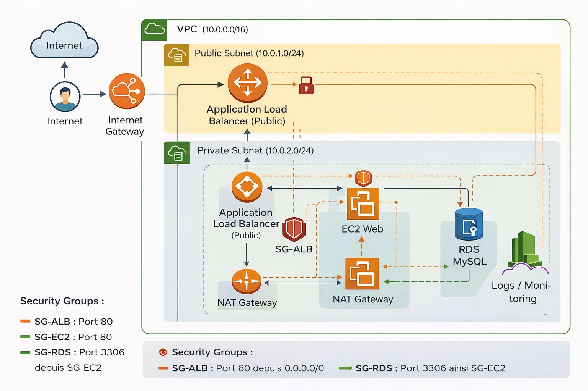

# 🚀 AWS 3-Tier Architecture — Portfolio Project

> **Decardo Koumous Wouile** · Ingénieur Cloud Computing, Virtualisation & Automatisation  
> 📍 Tunis, Tunisie · [LinkedIn](https://www.linkedin.com/in/decardo-koumous-wouile/) · [🌐 Application en ligne](https://deotech.online/) · [](https://wa.me/21626885727)

---

## 📊 Métriques du projet

| Indicateur | Valeur |
|---|---|
| ☁️ Cloud Provider | AWS (eu-west-3 — Paris) |
| 🏗️ Architecture | 3 tiers (Web / App / BDD) |
| 🔄 CI/CD | GitHub Actions (Pipeline actif) |
| 🗄️ Base de données | RDS MySQL (Multi-AZ ready) |
| ⚖️ Load Balancer | Application Load Balancer (ALB) |
| 🔒 Sécurité | VPC, Security Groups, IAM Roles, AWS WAF |
| 🌐 Domaine | deotech.online (HTTPS via ACM) |
| 📈 Scalabilité | Auto Scaling Group (min=1 / desired=2 / max=4) |
| 📅 Durée projet | Phase 1 (VPS) → Phase 2 (AWS) → Phase 3 (Optimisation ✅) |

---

## 🎯 Objectif

Ce projet démontre ma capacité à concevoir, déployer et automatiser une infrastructure cloud AWS de production, organisée en **3 couches distinctes** :

- **Tier 1 — Présentation** : Serveurs web EC2 derrière un ALB (Application Load Balancer)
- **Tier 2 — Application** : Logique métier sur instances EC2 dédiées en subnet privé
- **Tier 3 — Données** : Base de données RDS MySQL isolée dans un subnet privé

Ce projet illustre une migration réelle : **VPS → Cloud AWS**, avec mise en place d'un pipeline CI/CD complet via GitHub Actions, sécurisation HTTPS, auto-scaling et monitoring avancé.

---

## 🏗️ Architecture AWS



> *Diagramme de l'architecture AWS 3-Tier — VPC (10.0.0.0/16), Region eu-west-3 | Internet → WAF → ALB (HTTPS) → EC2 ASG (Web Tier) → EC2 (App Tier) → RDS MySQL (Data Tier)*

---

## 🛠️ Stack Technique

### ☁️ Cloud AWS
`EC2` `RDS MySQL` `VPC` `ALB` `ACM` `Route 53` `Auto Scaling` `CloudWatch` `WAF` `SNS` `S3`

### 🔄 CI/CD
`GitHub Actions` `Terraform Apply` `SSH Deploy` `Automated Tests` `Health Checks`

### 💻 Application
`Python / Flask` `Nginx` `Gunicorn` `MySQL Connector`

### 🔒 Sécurité
`VPC Isolation` `Private Subnets` `Security Groups` `IAM Roles` `SSH Keys` `AWS WAF` `HTTPS/TLS 1.3`

### 🏗️ Infrastructure as Code
`Terraform` `Modules VPC` `ALB` `ASG` `WAF` `Monitoring`

---

## 📁 Structure du projet

```
aws-3tier-portfolio/
├── .github/
│   └── workflows/
│       ├── deploy.yml          # Pipeline CI/CD GitHub Actions (app)
│       └── terraform.yml       # Pipeline Terraform (IaC)
├── app/
│   ├── app.py                  # Application Flask principale
│   ├── requirements.txt        # Dépendances Python
│   └── templates/              # Templates HTML
├── terraform/
│   ├── versions.tf             # Provider AWS ~> 5.0, backend S3
│   ├── variables.tf            # Variables : région, VPC, ASG, ALB, SNS...
│   ├── main.tf                 # Toutes les ressources AWS (ALB, ASG, WAF, CloudWatch...)
│   ├── outputs.tf              # DNS ALB, URLs, ARN, résumé déploiement
│   └── README.md               # Documentation Terraform
├── scripts/
│   ├── setup-web.sh            # Script config serveur web
│   └── setup-db.sh             # Script config base de données
├── screenshots/                # Captures AWS Console
├── Architecture.jpeg           # Schéma architecture
└── README.md
```

---

## 🔄 Pipeline CI/CD — GitHub Actions

Le pipeline se déclenche automatiquement à chaque `push` sur `main` :

```yaml
Phases du pipeline :
  1. 🔍 Checkout du code
  2. 🧪 Tests unitaires (Python)
  3. 🔐 Connexion SSH sécurisée vers EC2
  4. 📦 Déploiement de l'application
  5. 🔁 Redémarrage des services (Gunicorn/Nginx)
  6. ✅ Health Check de l'application
```

[](https://github.com/AnimusKWD/aws-3tier-portfolio/actions)

🔗 **Dernier run CI/CD** : [Run #24437943470](https://github.com/AnimusKWD/aws-3tier-portfolio/actions/runs/24437943470)

---

## 🚀 Phases du projet

### Phase 1 — Infrastructure VPS (Terminée ✅)
- Hébergement sur VPS dédié
- Déploiement manuel via SSH
- Application Flask + MySQL sur serveur unique
- Monitoring basique

### Phase 2 — Migration AWS (Terminée ✅)
- Migration complète vers AWS eu-west-3 (Paris)
- Architecture 3-tier avec VPC dédié
- Application Load Balancer pour la haute disponibilité
- RDS MySQL managé avec backups automatiques
- Pipeline CI/CD GitHub Actions opérationnel
- Security Groups et IAM roles configurés

### Phase 3 — Optimisation (Terminée ✅)
- [x] HTTPS avec ACM + Route 53 — L'application est exposée via un ALB en HTTPS avec un certificat ACM pour `deotech.online`
- [x] Auto Scaling Group (ASG) — Un Auto Scaling Group ajuste dynamiquement le nombre d'instances selon la charge (CPU/latence)
- [x] CloudWatch Alarms & Dashboards — Des alarmes CloudWatch et un dashboard supervisent la santé de l'ALB, de l'ASG et des réponses HTTP
- [x] Infrastructure as Code (Terraform) — Toute l'infrastructure est gérée en Infrastructure as Code avec Terraform (modules VPC, ALB, ASG, WAF, monitoring)
- [x] WAF pour la sécurité applicative — Un Web ACL AWS WAF protège l'ALB avec des règles managées et custom

---

## 🌐 Application en production

🔗 **URL publique** : [https://deotech.online](https://deotech.online)

> Application Flask démontrant la connectivité entre les 3 tiers et l'état de l'infrastructure. Accessible en HTTPS via certificat ACM — trafic HTTP redirigé automatiquement (301) vers HTTPS.

---

## 🏗️ Phase 3 — Infrastructure as Code (Terraform)

[](https://www.terraform.io/)
[](https://registry.terraform.io/providers/hashicorp/aws/latest)
[](terraform/)

### Ressources provisionnées via Terraform

| Ressource | Description | Statut |
|-----------|-------------|--------|
| `aws_lb` | Application Load Balancer public | ✅ |
| `aws_lb_listener` (HTTP) | Redirect 301 HTTP → HTTPS | ✅ |
| `aws_lb_listener` (HTTPS) | TLS 1.3 avec certificat ACM | ✅ |
| `aws_lb_target_group` | Health Check sur `/health.php` | ✅ |
| `aws_launch_template` | EC2 Amazon Linux 2023 + Apache + PHP | ✅ |
| `aws_autoscaling_group` | ASG min=1 / desired=2 / max=4 | ✅ |
| `aws_autoscaling_policy` | Scale-up (+1) et Scale-down (-1) | ✅ |
| `aws_route53_record` | Alias A pour `deotech.online` + `www` | ✅ |
| `aws_wafv2_web_acl` | Web ACL avec règles managées AWS + custom | ✅ |
| `aws_sns_topic` | Alertes email via SNS | ✅ |
| `aws_cloudwatch_metric_alarm` | CPU, UnhealthyHosts, 5xx ALB | ✅ |
| `aws_cloudwatch_dashboard` | Dashboard santé ALB / ASG / HTTP | ✅ |
| `aws_security_group` | SG ALB (public) + SG EC2 (ALB only) | ✅ |

### Structure Terraform
```
terraform/
├── versions.tf   # Provider AWS ~> 5.0, backend S3
├── variables.tf  # Variables : region, VPC, ASG, ALB, SNS...
├── main.tf       # Toutes les ressources AWS
├── outputs.tf    # DNS ALB, URLs, ARN, résumé déploiement
└── README.md     # Documentation Terraform
```

### Déploiement Terraform

```bash
# Prérequis : AWS CLI configuré, Terraform >= 1.5.7
cd terraform/

# Initialiser le backend S3
terraform init

# Vérifier le plan de déploiement
terraform plan -var-file="terraform.tfvars"

# Appliquer l'infrastructure
terraform apply -var-file="terraform.tfvars"
```

### Workflow CI/CD Terraform (GitHub Actions)

- **Pull Request** → `terraform fmt` + `terraform validate` + `terraform plan` (commenté sur la PR)
- **Push sur `main`** → `terraform apply` automatique en production

> Voir [terraform/README.md](terraform/README.md) pour les instructions de déploiement complètes.

---

## 📸 Captures d'écran

Les captures de la console AWS (VPC, EC2, RDS, ALB, ASG, CloudWatch, WAF) sont disponibles dans le dossier [`/screenshots`](./screenshots).

---

## 🏅 Certifications en cours

- ⏳ **AWS Certified Solutions Architect — Associate (SAA-C03)** — En préparation  
  *Ce projet couvre directement les domaines SAA-C03 : ELB, ACM, ASG, WAF, CloudWatch, Route 53, RDS, VPC, IAM*
- ✅ AWS Cloud Practitioner (Fondamentaux cloud maîtrisés)

---

## 👤 Auteur

**Decardo Koumous Wouile**  
Ingénieur Cloud Computing, Virtualisation & Automatisation  
📍 Tunis, Tunisie

[](https://www.linkedin.com/in/decardo-koumous-wouile/)
[](https://github.com/AnimusKWD)
[](https://wa.me/21626885727)

---

*Projet réalisé dans le cadre du développement de mon portfolio Cloud & DevOps — 2025-2026*
